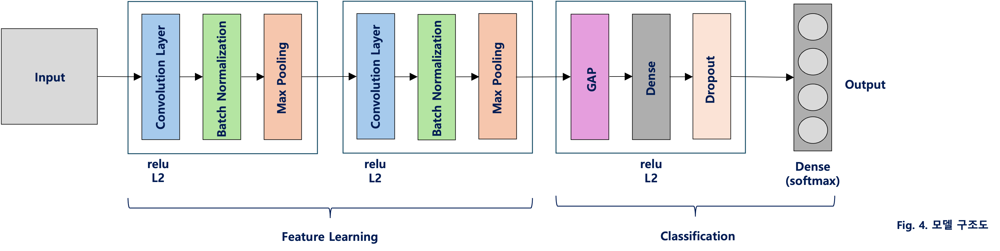
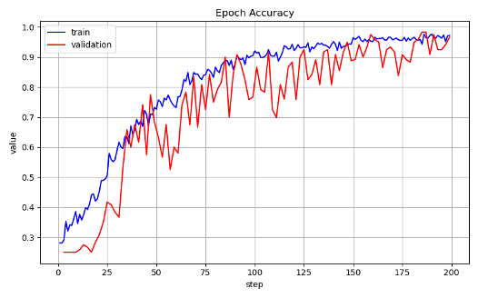
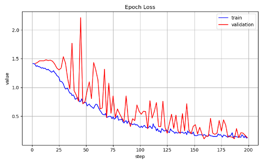
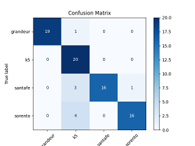

# Car Classification with CNN (Keras)

A lightweight CNN trained from scratch to classify four Korean car models — no transfer learning, ~800 training images.

**Report:** [seungjae99.github.io/dl_tp](https://seungjae99.github.io/dl_tp)

---

## Classes

| Class | Category |
|-------|----------|
| `grandeur` | Executive sedan |
| `k5` | Mid-size sedan |
| `santafe` | Mid-size SUV |
| `sorento` | Mid-size SUV |

---

## Model Architecture



Two Conv-BN-Pool blocks for feature extraction, followed by GlobalAveragePooling, Dense(128), and Dropout(0.6).
L2 regularization is applied to all trainable layers.

---

## Results

| | Accuracy | Loss |
|--|--|--|
| Train | 0.9721 | 0.1247 |
| Validation | 0.9667 | 0.1287 |

### Training Curves

 

### Test Set Evaluation



| Class | Precision | Recall | F1 |
|-------|-----------|--------|----|
| Grandeur | 1.00 | 0.95 | 0.97 |
| K5 | 0.71 | 1.00 | 0.83 |
| Santa Fe | 1.00 | 0.80 | 0.89 |
| Sorento | 0.94 | 0.80 | 0.86 |

---

## How to Run

All scripts are run from the `src/` directory.

```bash
# 1. Preprocess images (resize + zero-pad to 300x200)
python src/image_preprocess.py

# 2. Shuffle and rename
python src/shuffle_dataset.py

# 3. Split into train/test
python src/split_dataset.py

# 4. Train
python src/train.py

# 5. Evaluate on test set
python src/test.py

# 6. Single image inference
python src/predict.py
```

```bash
# TensorBoard
tensorboard --logdir=logs/
```

---

## Environment

- Python 3.8+
- TensorFlow / Keras 2.12+
- opencv-python, scikit-learn, matplotlib, pandas, tqdm
